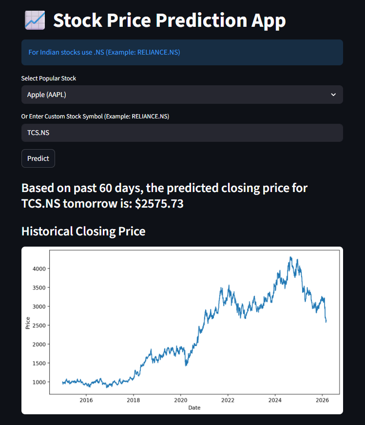

# 📈 Stock Price Prediction using LSTM (Streamlit App)

## 🚀 Project Overview

This project is a Machine Learning based Stock Price Prediction Web App built using:

- Python
- LSTM (Long Short-Term Memory)
- TensorFlow / Keras
- yFinance
- Streamlit

The model uses the past 60 days of closing prices to predict the next day's closing price of a selected stock.

---

## 🧠 How It Works

1. User selects a stock from dropdown OR enters custom stock symbol.
2. App downloads historical stock data using yFinance.
3. Data is scaled using MinMaxScaler.
4. LSTM model predicts next day closing price.
5. Predicted price is displayed on the web app.

---

## 🌐 Web App Preview

### 📸 Application Screenshot




---

## 📂 Project Structure

Stock-Price-Prediction/
│
├── lstm_model.h5
├── stock_prediction.ipynb
├── app.py
├── requirements.txt
├── README.md
└── app_screenshot.png


---

## 🛠 Installation

### 1️⃣ Clone the repository

```

git clone https://github.com/deepak-linkedin/Stock-Price-Prediction-LSTM.git
cd Stock-Price-Prediction-LSTM

```

### 2️⃣ Create Virtual Environment

python -m venv venv

Activate:

Windows:

venv\Scripts\activate


Mac/Linux:

source venv/bin/activate


### 3️⃣ Install Dependencies


pip install -r requirements.txt


---

## ▶️ Run the Application

streamlit run app.py


## 📊 Model Details

- Model Type: LSTM Neural Network
- Input: 60 previous trading days
- Output: Next trading day closing price
- Loss Function: Mean Squared Error
- Optimizer: Adam

---

## ✅ Features

- Popular stock dropdown
- Custom stock input
- Invalid ticker validation
- Displays available data range
- Next day prediction
- Clean UI with Streamlit

---

## 🚀 Live Demo
🔗 Live App: https://stock-price-prediction-lstm-deepak.streamlit.app/

## ⚠️ Disclaimer

This project is for educational purposes only.  
Stock market predictions are not guaranteed and should not be used for financial decisions.

---
